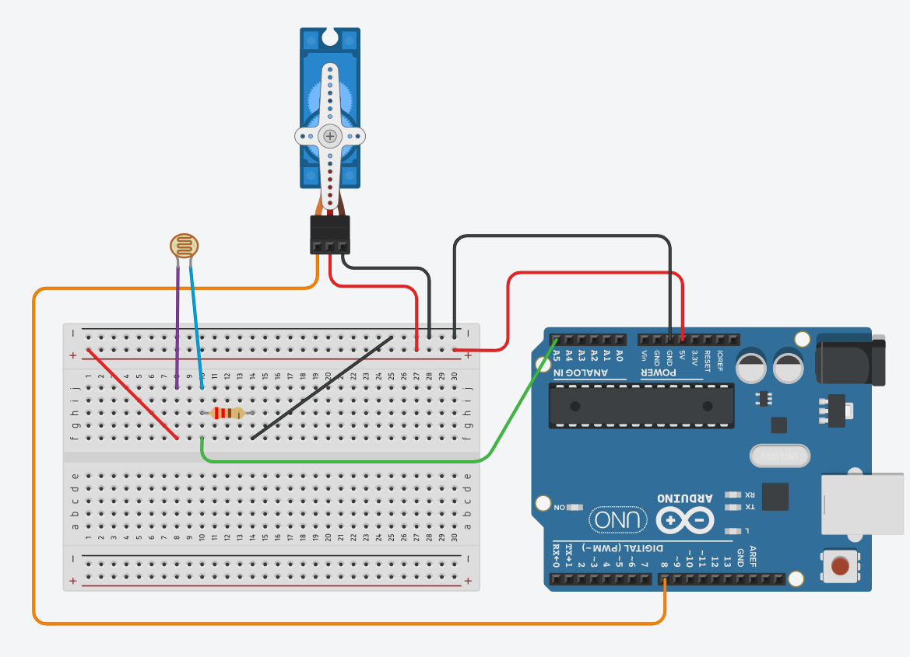
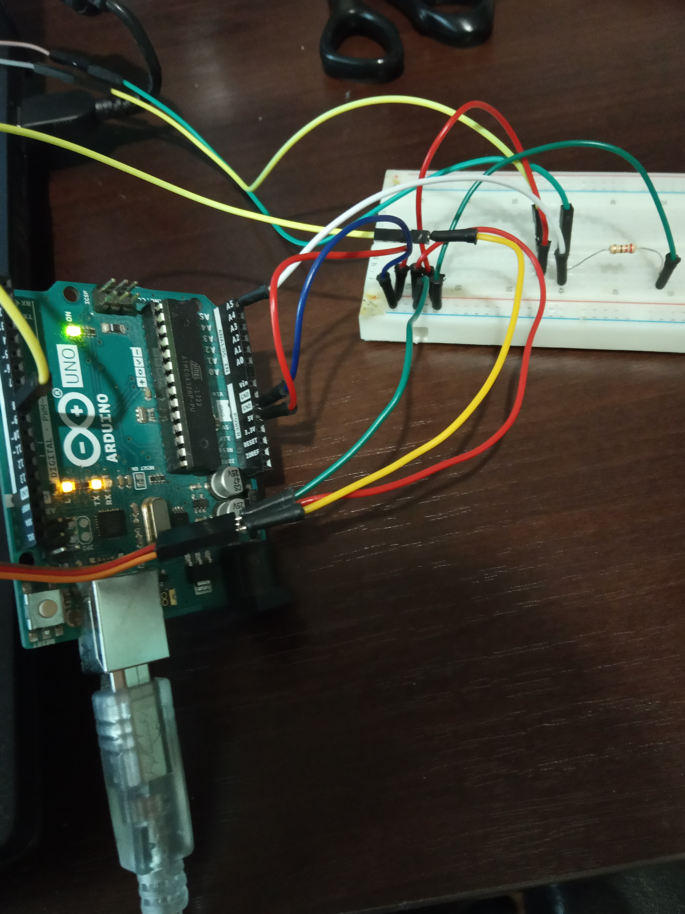

# What is it?
T-Rex Auto Runner is an Arduino script for Google Chrome T-Rex Run game. Using micro servo and photoresistor it automaticly clicks spacebar at the right time, so basically it plays by its own **(for now, it only works on the white level)**.

# How does it work?
Photoresistor gets light level from the screen (white background) and if it gets a value below average (cactus) it sends a signal to micro servo to move propeller which clicks a spacebar, then Dino jumps.

# How can I build it?
If you want to build it, you would need:

1. Any Arduino with 5V power output and with digital and analog pins (I used Arduino Uno),
1. 220 Ohm resistor (I used this one, but you can also use different ones. I recommend checking out this guy's video: https://youtu.be/INekoMGeXac,
1. Some wires,
1. Breadboard,
1. Photoresesitor,
1. Tower Pro micro servo SG90.

Circuit for this project (circuit created with [Tinkercad](https://tinkercad.com)):

1. Place photoresistor at that distance from Dino, that if it detects cactus, it immediately clicks spacebar.
1. Place servo properly on your spacebar, so the propeller can click it.
1. Adjust code for your setup. It can various by:
  1. your screen size,
  1. your screen brightness,
  1. your display,
  1. yours monitor refresh rate,
  1. resistor and power you used for photoresistor
